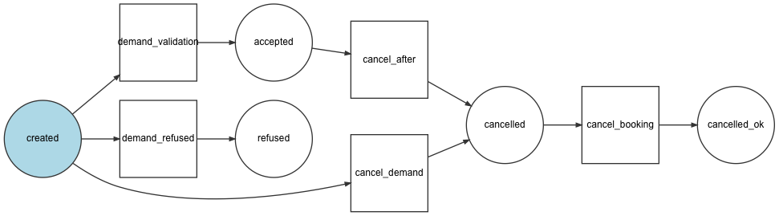

# Workflow
**created** : Etat initale
**demand_accepted :** La demande à été accepté par la secrétaire
**demand_refused :** La demande à été refusé par la secrétaire
**validation_accepted :** L'utilisateur accepte la validation
**validation_refused :** L'utilisateur refuse la validation
**annulation :** L'utilisateur annule la reservation
